# 🏗️ The Engineering Manifesto

This document defines the **Laws of the House** that must never be broken. These principles ensure a maintainable, scalable, and professional codebase.

---

## Core Principle: Strict Separation of Concerns

> [!CAUTION] > **The UI must NEVER know how data is fetched, and the Database must NEVER know how data is displayed.**

This is the foundational rule of the architecture. Violations create tight coupling that makes the codebase fragile and untestable.

### Enforcement Rules

1. **Components** handle only rendering and user interactions
2. **Services** handle data fetching, transformation, and business logic
3. **API routes** handle HTTP concerns (status codes, headers, request/response mapping)
4. **Models/Types** define data contracts between layers

```
┌─────────────────────────────────────────────────────────────┐
│                        UI LAYER                             │
│  (Components, Pages, Hooks)                                 │
│  ✅ Rendering, User Events, Local State                     │
│  ❌ fetch(), API URLs, Database queries                     │
└─────────────────────────────────────────────────────────────┘
                              │
                              ▼
┌─────────────────────────────────────────────────────────────┐
│                      SERVICE LAYER                          │
│  (Services, Utilities, Helpers)                             │
│  ✅ Business Logic, Data Transformation, API Calls          │
│  ❌ DOM manipulation, CSS, UI state                         │
└─────────────────────────────────────────────────────────────┘
                              │
                              ▼
┌─────────────────────────────────────────────────────────────┐
│                       DATA LAYER                            │
│  (API Routes, Database, External APIs)                      │
│  ✅ Data persistence, HTTP handling, Caching                │
│  ❌ Business rules, UI concerns, Formatting                 │
└─────────────────────────────────────────────────────────────┘
```

---

## The "No-Hardcoding" Rule

> [!IMPORTANT]
> Any value (color, spacing, API URL, configuration) used more than once **MUST** be abstracted.

### What Must Be Abstracted

| Type          | Location                          | Example                                  |
| ------------- | --------------------------------- | ---------------------------------------- |
| Colors        | `globals.css` (CSS Variables)     | `--color-primary`, `--color-bg-glass`    |
| Spacing       | `globals.css` (CSS Variables)     | `--spacing-sm`, `--spacing-lg`           |
| Typography    | `globals.css` (CSS Variables)     | `--font-size-base`, `--font-weight-bold` |
| API URLs      | `config/api.ts` or `.env`         | `API_BASE_URL`, `ENDPOINT_USERS`         |
| Magic Numbers | Named constants in relevant files | `MAX_RETRIES = 3`, `CACHE_TTL = 300`     |
| Feature Flags | `config/features.ts`              | `ENABLE_DARK_MODE`, `SHOW_BETA_FEATURES` |

### Violation Examples

```css
/* ❌ FORBIDDEN - Hardcoded values */
.button {
  background: #1e40af;
  padding: 8px 16px;
  border-radius: 4px;
}

/* ✅ CORRECT - Variable references */
.button {
  background: var(--color-primary);
  padding: var(--spacing-sm) var(--spacing-md);
  border-radius: var(--radius-sm);
}
```

```typescript
/* ❌ FORBIDDEN - Hardcoded API URL */
const response = await fetch("https://api.example.com/users");

/* ✅ CORRECT - Config reference */
import { API_ENDPOINTS } from "@/config/api";
const response = await fetch(API_ENDPOINTS.users);
```

---

## Folder Structure Mandate

> [!NOTE]
> The agent MUST follow this directory structure. New files must be placed in their appropriate location.

```
project-root/
├── .agent/
│   └── workflows/          # Agent instruction files
│
├── src/
│   ├── app/                # Next.js App Router (THIN routing only)
│   │   ├── page.tsx        # Root page (thin wrapper)
│   │   ├── layout.tsx      # Root layout
│   │   └── [feature]/
│   │       └── page.tsx    # Feature page (thin wrapper)
│   │
│   ├── components/
│   │   ├── ui/             # Atomic UI components (Button, Input, Badge, etc.)
│   │   ├── layout/         # Layout components (Header, Sidebar, Footer)
│   │   └── pages/          # Page-specific "thick" components with logic
│   │       └── [feature]/
│   │           ├── FeaturePage.tsx
│   │           ├── FeaturePage.module.css
│   │           └── index.ts
│   │
│   ├── services/           # Business logic and data fetching
│   │   ├── api/            # API client and endpoint definitions
│   │   └── [domain]/       # Domain-specific services
│   │
│   ├── hooks/              # Custom React hooks
│   │
│   ├── types/              # TypeScript type definitions
│   │
│   ├── utils/              # Pure utility functions
│   │
│   ├── config/             # Configuration files
│   │
│   └── styles/
│       └── globals.css     # CSS variables and global styles
│
├── public/                 # Static assets
│   └── icons/              # SVG icons
│
└── docs/                   # Project documentation
```

### Folder Responsibilities

| Folder               | Purpose        | Contains                                                      |
| -------------------- | -------------- | ------------------------------------------------------------- |
| `app/`               | Routing ONLY   | Thin `page.tsx` wrappers that import from `components/pages/` |
| `components/ui/`     | Reusable atoms | Button, Input, Badge, Card, Modal, Dropdown                   |
| `components/layout/` | App structure  | Header, Sidebar, Footer, Navigation                           |
| `components/pages/`  | Feature logic  | Complex components with business logic                        |
| `services/`          | Data layer     | API calls, data transformation, caching                       |
| `hooks/`             | React logic    | Custom hooks for shared stateful logic                        |
| `types/`             | Contracts      | TypeScript interfaces and types                               |
| `utils/`             | Pure functions | Helpers with no side effects                                  |
| `config/`            | Settings       | Environment config, feature flags, constants                  |

---

## Dependency Flow

```mermaid
graph TD
    A["app/ (Pages)"] --> B["components/pages/"]
    B --> C["components/ui/"]
    B --> D["services/"]
    B --> E["hooks/"]
    D --> F["types/"]
    E --> D
    C --> G["styles/globals.css"]

    style A fill:#1e3a5f
    style B fill:#2d4a6f
    style C fill:#3d5a7f
    style D fill:#4d6a8f
    style E fill:#5d7a9f
    style F fill:#6d8aaf
    style G fill:#7d9abf
```



**Rule**: Dependencies flow DOWNWARD. Lower layers must never import from upper layers.

---

## Quick Reference Checklist

Before writing any code, verify:

- [ ] Is the concern in the correct layer?
- [ ] Are all values abstracted (no hardcoding)?
- [ ] Is the file in the correct folder?
- [ ] Does the dependency flow respect the hierarchy?
- [ ] Is the component reusable or page-specific?
