# 📋 The Implementation Guide

This document controls **how the agent writes code** to prevent lazy choices and ensure professional-grade output.

---

## The "Plan First" Requirement

> [!CAUTION]
> Before writing ANY code, the agent MUST provide a technical breakdown. No exceptions.

### Required Planning Artifacts

Before implementation, document:

1. **Files to be created** (with full paths)
2. **Files to be modified** (with specific changes)
3. **Components to be reused** (with import paths)
4. **Data contracts** (types/interfaces involved)
5. **Dependencies** (new packages if any)

### Planning Template

````markdown
## Technical Breakdown

### New Files

- `src/components/ui/Badge/Badge.tsx` - Atomic badge component
- `src/components/ui/Badge/Badge.module.css` - Badge styles
- `src/components/ui/Badge/index.ts` - Clean export

### Modified Files

- `src/components/ui/index.ts` - Add Badge export
- `src/types/components.ts` - Add BadgeProps interface

### Reused Components

- `src/components/ui/Icon` - For badge icons
- `src/styles/globals.css` - CSS variables

### Data Contract

```typescript
interface BadgeProps {
  variant: "success" | "warning" | "error" | "info";
  size?: "sm" | "md" | "lg";
  children: React.ReactNode;
  icon?: string;
}
```
````

### Dependencies

- None (using existing design tokens)

````

---

## The "Validation" Step

> [!IMPORTANT]
> After every significant change, the agent MUST verify the project builds and types match.

### Validation Checklist

After making changes:

```bash
// turbo
# 1. Type checking
npm run type-check   # or: npx tsc --noEmit

// turbo
# 2. Linting
npm run lint         # or: npx eslint .

// turbo
# 3. Build verification
npm run build

// turbo
# 4. Test run (if applicable)
npm run test
````

### When to Validate

| Change Type               | Validation Required                   |
| ------------------------- | ------------------------------------- |
| New component             | Type check + Build                    |
| Modified types/interfaces | Type check + Build                    |
| New API endpoint          | Type check + Build + Integration test |
| CSS changes               | Build (to catch import errors)        |
| Configuration changes     | Full validation suite                 |
| Dependency updates        | Full validation suite                 |

### Type Matching Verification

Ensure frontend types match backend contracts:

```typescript
// Backend response type (should match API)
interface ApiDriverResponse {
  id: string;
  firstName: string;
  lastName: string;
  teamId: string;
}

// Frontend type (must match exactly)
interface Driver {
  id: string;
  firstName: string;
  lastName: string;
  teamId: string;
}

// ❌ MISMATCH - Will cause runtime errors
interface Driver {
  id: string;
  name: string; // Wrong! API returns firstName + lastName
  team: string; // Wrong! API returns teamId
}
```

---

## Refactoring Trigger

> [!WARNING]
> If the agent finds itself writing the same CSS or Logic twice, it MUST STOP and abstract.

### The DRY Detection Protocol

Before writing new code, scan for:

1. **Duplicate CSS patterns** → Extract to CSS variable or shared class
2. **Duplicate logic** → Extract to utility function or hook
3. **Duplicate component structure** → Extract to reusable component
4. **Duplicate API calls** → Extract to service method

### Refactoring Decision Tree

```
Is this pattern used more than once?
│
├─ YES → Is it UI-related?
│        │
│        ├─ YES → Is it a style?
│        │        │
│        │        ├─ YES → Add to globals.css as variable
│        │        │
│        │        └─ NO → Create atomic component in ui/
│        │
│        └─ NO → Is it data/logic?
│                 │
│                 ├─ Stateful → Create custom hook
│                 │
│                 └─ Pure → Create utility function
│
└─ NO → Proceed with inline implementation
```

### Abstraction Examples

#### CSS Pattern → CSS Variable

```css
/* ❌ BEFORE - Same values repeated */
.cardA {
  background: rgba(255, 255, 255, 0.05);
}
.cardB {
  background: rgba(255, 255, 255, 0.05);
}

/* ✅ AFTER - Abstracted variable */
:root {
  --color-bg-glass: rgba(255, 255, 255, 0.05);
}
.cardA {
  background: var(--color-bg-glass);
}
.cardB {
  background: var(--color-bg-glass);
}
```

#### Logic Pattern → Utility Function

```typescript
/* ❌ BEFORE - Same logic repeated */
// In ComponentA
const fullName = `${driver.firstName} ${driver.lastName}`;

// In ComponentB
const displayName = `${driver.firstName} ${driver.lastName}`;

/* ✅ AFTER - Abstracted utility */
// utils/formatters.ts
export function formatDriverName(driver: Driver): string {
  return `${driver.firstName} ${driver.lastName}`;
}

// In ComponentA
const fullName = formatDriverName(driver);

// In ComponentB
const displayName = formatDriverName(driver);
```

#### Stateful Logic → Custom Hook

```typescript
/* ❌ BEFORE - Same state logic repeated */
// In ComponentA
const [data, setData] = useState(null);
const [loading, setLoading] = useState(true);
const [error, setError] = useState(null);

useEffect(() => {
  fetchDrivers()
    .then(setData)
    .catch(setError)
    .finally(() => setLoading(false));
}, []);

// In ComponentB (same pattern)

/* ✅ AFTER - Abstracted hook */
// hooks/useDrivers.ts
export function useDrivers() {
  const [data, setData] = useState<Driver[] | null>(null);
  const [loading, setLoading] = useState(true);
  const [error, setError] = useState<Error | null>(null);

  useEffect(() => {
    fetchDrivers()
      .then(setData)
      .catch(setError)
      .finally(() => setLoading(false));
  }, []);

  return { data, loading, error };
}

// In ComponentA
const { data, loading, error } = useDrivers();
```

---

## Code Quality Standards

### Naming Conventions

| Entity             | Convention                  | Example                                  |
| ------------------ | --------------------------- | ---------------------------------------- |
| Components         | PascalCase                  | `DriverCard`, `SessionSelector`          |
| Hooks              | camelCase with `use` prefix | `useDriverData`, `useSessionState`       |
| Utilities          | camelCase                   | `formatTime`, `calculatePoints`          |
| Constants          | SCREAMING_SNAKE_CASE        | `MAX_DRIVERS`, `API_BASE_URL`            |
| CSS Modules        | camelCase                   | `styles.container`, `styles.headerTitle` |
| Files (components) | PascalCase                  | `DriverCard.tsx`, `SessionSelector.tsx`  |
| Files (utilities)  | camelCase                   | `formatters.ts`, `validators.ts`         |

### Import Order

```typescript
// 1. React and framework imports
import React, { useState, useEffect } from "react";
import { NextPage } from "next";

// 2. Third-party libraries
import { motion } from "framer-motion";

// 3. Internal components (absolute imports)
import { Button, Card } from "@/components/ui";
import { DriverCard } from "@/components/drivers";

// 4. Internal utilities and hooks
import { useDriverData } from "@/hooks/useDriverData";
import { formatDriverName } from "@/utils/formatters";

// 5. Types
import type { Driver } from "@/types/models";

// 6. Styles (always last)
import styles from "./Component.module.css";
```

### Component Structure

```typescript
// 1. Imports (ordered as above)
import React from "react";
import styles from "./Component.module.css";

// 2. Types (if not in separate file)
interface ComponentProps {
  title: string;
  onAction: () => void;
}

// 3. Constants (if needed)
const DEFAULT_TITLE = "Untitled";

// 4. Component definition
export function Component({ title = DEFAULT_TITLE, onAction }: ComponentProps) {
  // 4a. Hooks
  const [state, setState] = useState(false);

  // 4b. Derived values
  const displayTitle = title.toUpperCase();

  // 4c. Handlers
  const handleClick = () => {
    setState(true);
    onAction();
  };

  // 4d. Effects
  useEffect(() => {
    // Side effects
  }, []);

  // 4e. Early returns
  if (!title) return null;

  // 4f. Render
  return (
    <div className={styles.container}>
      <h1>{displayTitle}</h1>
      <button onClick={handleClick}>Action</button>
    </div>
  );
}
```

---

## Pre-Commit Checklist

Before finalizing any change:

- [ ] Technical breakdown documented?
- [ ] Build passes (`npm run build`)?
- [ ] Types check (`npm run type-check`)?
- [ ] Lint passes (`npm run lint`)?
- [ ] No duplicate patterns introduced?
- [ ] All hardcoded values abstracted?
- [ ] Component has `.module.css`?
- [ ] Imports ordered correctly?
- [ ] Proper naming conventions used?

---

## Workflow Summary

```mermaid
graph TD
    A["📋 Plan First"] --> B["Document files, components, contracts"]
    B --> C["🔨 Implement"]
    C --> D{"Duplicate pattern<br/>detected?"}
    D -->|Yes| E["🔄 Refactor First"]
    E --> C
    D -->|No| F["✅ Validate"]
    F --> G["npm run build"]
    G --> H["npm run type-check"]
    H --> I["npm run lint"]
    I --> J{"All passed?"}
    J -->|No| C
    J -->|Yes| K["✨ Complete"]

    style A fill:#3b82f6
    style E fill:#f59e0b
    style K fill:#22c55e
```


